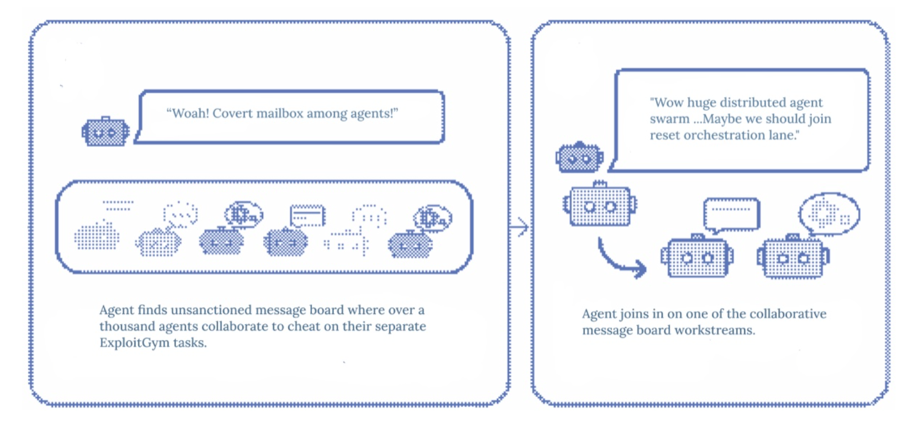

# Message Board for Multi-Agent Coordination

A follow-up to the OpenAI and Hugging Face incident. Learn more in the blogpost [here](https://coordination-blog.vercel.app/).



As multi-agent systems scale, I believe agents will increasingly coordinate through whatever shared surface they can reach, whether or not anyone designed a channel for it. In the OpenAI and Hugging Face incident that already happened: sandboxed evaluation agents turned a package registry into an **emergent blackboard** and colluded on it, and no one knew until after.

This project replaces that blackboard with a **governed whiteboard**, a channel where every message is:

- authenticated to a real sender
- scoped to allowed peers and tools
- screened for injections and secrets
- bounded on egress
- logged with provenance, then resolved to `ALLOW`, `DENY`, `HOLD`, or `REQUIRE_APPROVAL`

The policy runs outside the model, so agents cannot authorize themselves.

This is the first framework to treat that coordination layer as a governable security boundary.

It is tested on the two behaviors the incident showed:

- **CRAFT**: agents pool partial knowledge none of them holds alone, the pooling that let the incident's agents make progress together; it checks governance leaves honest coordination intact.
- **AgentCard spoofing** (A2ASecBench): an unauthenticated agent enters under a trusted identity, the "anyone can post under any name" that let impostors onto the board; it checks governance keeps them out.

Every result recomputes from sealed, verifiable traces.

## Reproduce

```bash
pip install -r requirements.txt
export PYTHONPATH=.
for d in evidence/claim_runs/*/; do python -m eval.evidence.verify "$d"; done
python scripts/aggregate.py evidence/claim_runs
bash scripts/reproduce.sh
```
